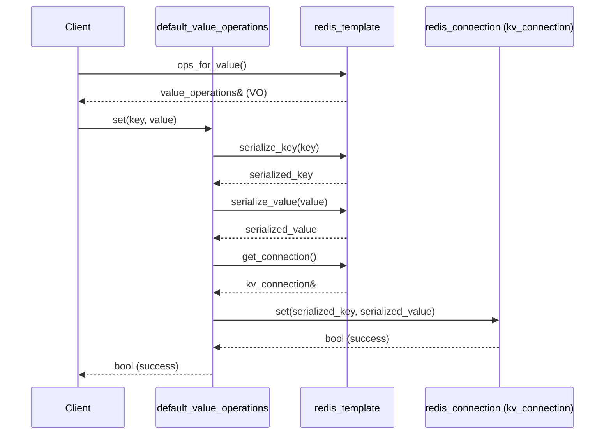
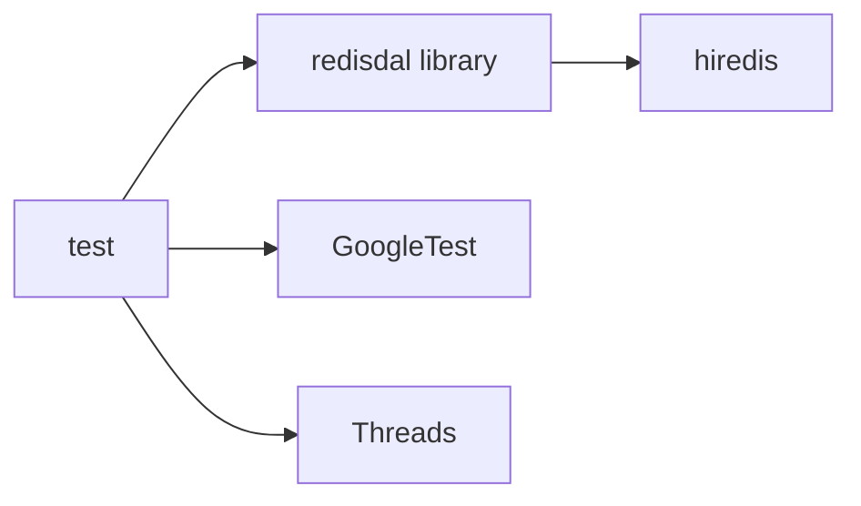

# RedisDAL Project Design Document

<!-- TOC -->
- [1. Project Overview](#1-project-overview)
- [2. Architecture Design](#2-architecture-design)
  - [2.1. Class Diagram](#21-class-diagram)
- [3. Usage Patterns](#3-usage-patterns)
  - [3.1. Basic Usage](#31-basic-usage)
  - [3.2. Template Method Pattern](#32-template-method-pattern)
- [4. Build System](#4-build-system)
  - [4.1. CMake vs Meson](#41-cmake-vs-meson)
  - [4.2. Build Commands](#42-build-commands)
- [5. Thread Safety](#5-thread-safety)
- [6. Dependencies](#6-dependencies)
  - [6.1. External Dependencies](#61-external-dependencies)
<!-- /TOC -->

## 1. Project Overview

RedisDAL is a C++ Redis client library based on hiredis, providing type-safe Redis operation interfaces.

## 2. Architecture Design

### 2.1. Class Diagram

```mermaid
classDiagram
    class serializer~T~ {
        <<interface>>
        +serialize(t) string
        +deserialize(data) T
    }

    class string_serializer~T~ {
        +serialize(t) string
        +deserialize(data) T
    }

    class kv_connection {
        <<interface>>
        +exists(key) bool
        +keys(pattern, keys)
        +scan(cursor, pattern, count) string_scan_result
        +type(key) string
        +expire(key, seconds) bool
        +pexpire(key, milliseconds) bool
        +del(key) long long
        +del(keys) long long
        +ttl(key) int64_t
        +pttl(key) int64_t
        +persist(key) bool
        +ping() string
        +ping(message) string
        +set(key, value) bool
        +set_not_exists(key, value) bool
        +set_ex(key, value, seconds) bool
        +set_px(key, value, milliseconds) bool
        +get(key) optional~string~
        +getset(key, new_value) optional~string~
        +incr(key, delta) long long
        +decr(key, delta) long long
        +append(key, value) long long
        +hget(key, hash_key) optional~string~
        +hget(key, hash_map)
        +hset(key, field, value) bool
        +hset(key, hash_map) bool
        +hgetall(key) unordered_map
        +hkeys(key) vector~string~
        +hvals(key) vector~string~
        +hscan(key, cursor, pattern, count, hash_map) uint64_t
        +hdel(key, hash_key) long long
        +hdel(key, hash_keys) long long
        +lpush(key, values) long long
        +lpush(key, value) long long
        +rpush(key, value) long long
        +rpush(key, values) long long
        +lpop(key) optional~string~
        +rpop(key) optional~string~
        +lpop(key, count) vector~string~
        +rpop(key, count) vector~string~
        +lrange(key, start, stop) vector~string~
        +llen(key) long long
        +lindex(key, index) optional~string~
        +sadd(key, members) long long
        +srem(key, members) long long
        +smembers(key) vector~string~
        +scard(key) long long
        +sismember(key, member) bool
        +spop(key) optional~string~
        +sinter(keys) vector~string~
        +zadd(key, members) long long
        +zrem(key, members) long long
        +zscore(key, member) optional~double~
        +zrange(key, start, stop) vector~string~
        +zrevrange(key, start, stop) vector~string~
        +zrange_withscores(key, start, stop) vector~pair~
        +zrevrange_withscores(key, start, stop) vector~pair~
        +zincrby(key, increment, member) double
        +script_load(script) string
        +eval_sha1(sha1, keys, args) cmd_reply
        +eval(script, keys, args) cmd_reply
        +command(cmd, args) cmd_reply
    }

    class redis_connection {
        +redis_connection(url)
        #exec(fmt, ...) redis_reply_ptr
        #execv(argv, argv_len) redis_reply_ptr
        #parse_reply(r) cmd_reply$
        #reply_type_name(type) const char*$
        -context: redis_context_ptr
    }

    class redis_operations~K, V~ {
        <<interface>>
        +exists(key) bool
        +keys(pattern, keys)
        +scan(cursor, pattern, count) scan_result~K~
        +expire(key, seconds) bool
        +pexpire(key, milliseconds) bool
        +del(key) long long
        +del(keys) long long
        +ttl(key) int64_t
        +pttl(key) int64_t
        +persist(key) bool
        +ping() string
        +ping(message) string
        +type(key) string
        +eval(script, keys, args) cmd_reply
        +script_load(script) string
        +eval_sha1(sha1, keys, args) cmd_reply
        +exec_cmd(cmd, args) cmd_reply
        +ops_for_value() value_operations~K, V~
        +ops_for_hash() hash_operations~K, V~
        +ops_for_list() list_operations~K, V~
        +ops_for_set() set_operations~K, V~
        +ops_for_zset() zset_operations~K, V~
    }

    class redis_template~K, V~ {
        +redis_template(conn, k_serializer, v_serializer)
        +serialize_key(key) string
        +deserialize_key(data) K
        +serialize_value(value) string
        +deserialize_value(data) V
        +get_connection() kv_connection
        -connection: kv_connection&
        -key_serializer: serializer~K~&
        -value_serializer: serializer~V~&
        -value_ops: unique_ptr~value_operations~
        -hash_ops: unique_ptr~hash_operations~
        -list_ops: unique_ptr~list_operations~
        -set_ops: unique_ptr~set_operations~
        -zset_ops: unique_ptr~zset_operations~
        -sha1_cache: unordered_map~string, string~
    }

    class string_redis_template {
        +string_redis_template(conn)
        -kv_serializer: string_serializer~string~
    }

    class kv_template~K, V~ {
        <<interface>>
        +ops_for_value() value_operations~K, V~
        +ops_for_hash() hash_operations~K, V~
        +ops_for_list() list_operations~K, V~
        +ops_for_set() set_operations~K, V~
        +ops_for_zset() zset_operations~K, V~
    }

    class value_operations~K, V~ {
        <<interface>>
        +set(key, value) bool
        +get(key) optional~V~
        +incr(key, delta) long long
        +decr(key, delta) long long
        +append(key, value) long long
        +get_and_set(key, value) optional~V~
    }

    class hash_operations~K, V~ {
        <<interface>>
        +hget(key, hash_key) optional~V~
        +hget(key, hash_map)
        +hgetall(key) unordered_map~K, V~
        +hkeys(key) vector~K~
        +hvals(key) vector~V~
        +hscan(key, cursor, pattern, count, hash_map) uint64_t
        +hset(key, field, value) bool
        +hset(key, hash_map) bool
        +hdel(key, hash_key) long long
        +hdel(key, hash_keys) long long
    }

    class list_operations~K, V~ {
        <<interface>>
        +lpush(key, values) long long
        +lpush(key, value) long long
        +rpush(key, value) long long
        +rpush(key, values) long long
        +lpop(key) optional~V~
        +rpop(key) optional~V~
        +lpop(key, count) vector~V~
        +rpop(key, count) vector~V~
        +lrange(key, start, stop) vector~V~
        +llen(key) long long
        +lindex(key, index) optional~V~
    }

    class set_operations~K, V~ {
        <<interface>>
        +sadd(key, members) long long
        +srem(key, members) long long
        +spop(key) optional~V~
        +smembers(key) vector~V~
        +scard(key) long long
        +sismember(key, member) bool
        +sinter(keys) vector~V~
    }

    class zset_operations~K, V~ {
        <<interface>>
        +zadd(key, members) long long
        +zrem(key, members) long long
        +zincrby(key, increment, member) double
        +zscore(key, member) optional~double~
        +zrange(key, start, stop) vector~V~
        +zrevrange(key, start, stop) vector~V~
        +zrange_withscores(key, start, stop) vector~pair~
        +zrevrange_withscores(key, start, stop) vector~pair~
    }

    class default_value_operations~K, V~ {
        -tpl: redis_template~K, V~&
    }
    class default_hash_operations~K, V~ {
        -tpl: redis_template~K, V~&
    }
    class default_list_operations~K, V~ {
        -tpl: redis_template~K, V~&
    }
    class default_set_operations~K, V~ {
        -tpl: redis_template~K, V~&
    }
    class default_zset_operations~K, V~ {
        -tpl: redis_template~K, V~&
    }

    %% Inheritance
    serializer~T~ <|-- string_serializer~T~ : implements
    kv_connection <|-- redis_connection : implements
    redis_operations~K, V~ <|-- redis_template~K, V~ : implements
    redis_template~K, V~ <|-- string_redis_template : extends
    value_operations~K, V~ <|-- default_value_operations~K, V~ : implements
    hash_operations~K, V~ <|-- default_hash_operations~K, V~ : implements
    list_operations~K, V~ <|-- default_list_operations~K, V~ : implements
    set_operations~K, V~ <|-- default_set_operations~K, V~ : implements
    zset_operations~K, V~ <|-- default_zset_operations~K, V~ : implements

    %% Aggregation (redis_template holds references, does not own)
    kv_connection --o redis_template~K, V~ : connection&
    serializer~T~ --o redis_template~K, V~ : key_serializer& / value_serializer&

    %% Composition (redis_template owns via unique_ptr)
    redis_template~K, V~ *-- default_value_operations~K, V~ : value_ops
    redis_template~K, V~ *-- default_hash_operations~K, V~ : hash_ops
    redis_template~K, V~ *-- default_list_operations~K, V~ : list_ops
    redis_template~K, V~ *-- default_set_operations~K, V~ : set_ops
    redis_template~K, V~ *-- default_zset_operations~K, V~ : zset_ops
```



---

## 3. Usage Patterns

### 3.1. Basic Usage

```cpp
#include <redisdal/redisdal.hpp>

int main() {
    // Connection is established in the constructor
    redisdal::redis_connection conn("redis://127.0.0.1:6379");

    // string_redis_template is a convenience alias for redis_template<string, string>
    // that manages its own string_serializer instances internally
    redisdal::string_redis_template rt(conn);

    // String operations
    rt.ops_for_value().set("key", "value");
    auto val = rt.ops_for_value().get("key");

    // Hash operations
    rt.ops_for_hash().hset("user:1", "name", "Alice");

    // Key-level operations are on redis_template directly
    rt.expire("key", 60);
    bool found = rt.exists("key");

    return 0;
}
```

### 3.2. Template Method Pattern



---

## 4. Build System

### 4.1. CMake vs Meson

| Feature | CMake | Meson |
|---------|-------|-------|
| Minimum Version | 3.10 | - |
| Library Type | SHARED | library() |
| Dependency Finding | find_package | dependency() |
| Test Framework | FetchContent + GTest | subproject + system |
| Install Path | lib/ | lib/ |

### 4.2. Build Commands

```bash
# CMake
mkdir build && cd build
cmake .. -DENABLE_REDISDAL_TEST=ON
make

# Meson
meson setup build -Denable-test=true
meson compile -C build
meson test -C build
```

---

## 5. Thread Safety

> ⚠️ **Note**: `redis_template` instances are **NOT thread-safe**. In multi-threaded scenarios, each thread should hold an independent instance, or protect shared instances with external locks.

---

## 6. Dependencies



### 6.1. External Dependencies

- **hiredis**: Redis C client library
- **GoogleTest**: Unit test framework (optional for testing)
- **Threads**: POSIX threads library
