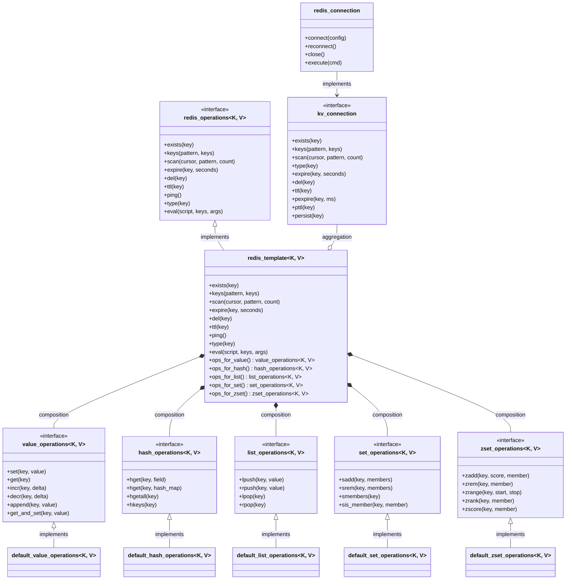
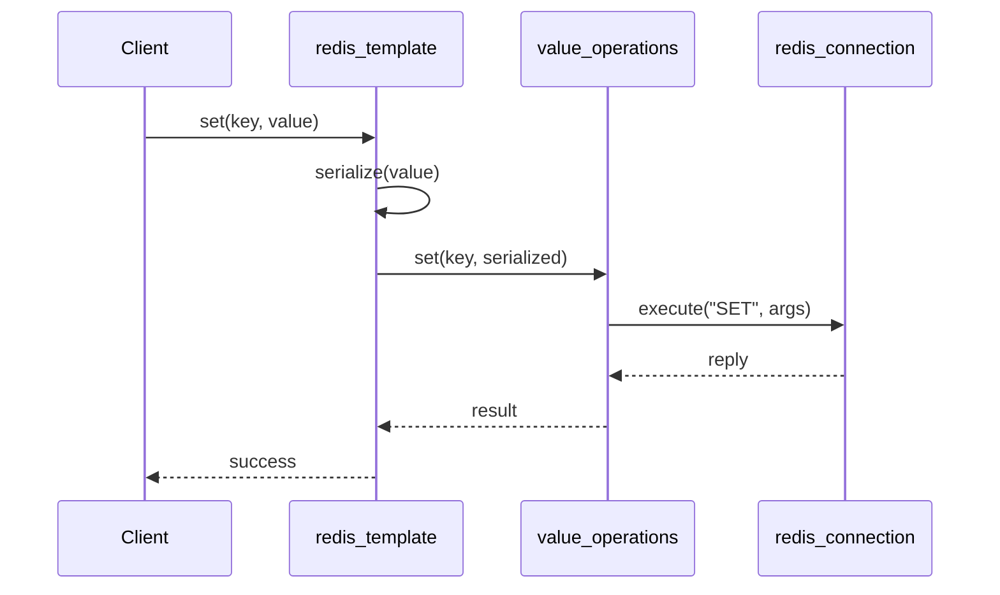
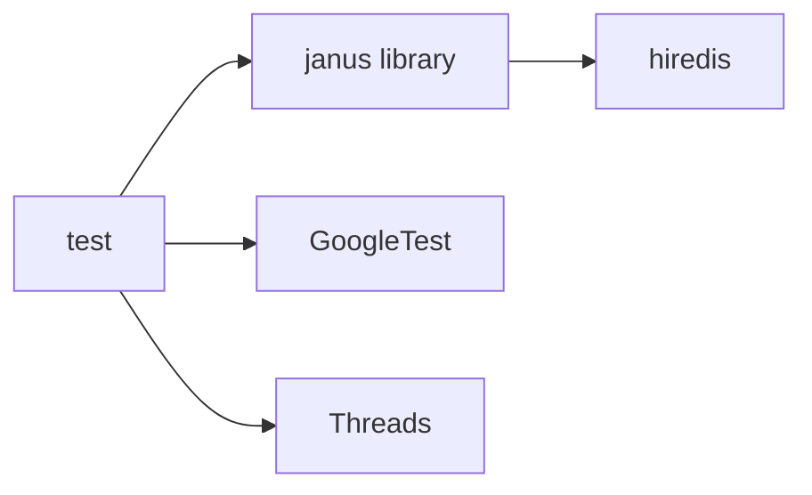

# Janus Project Design Document

<!-- TOC -->
- [1. Project Overview](#1.-project-overview)
- [2. Architecture Design](#2.-architecture-design)
  - [2.1. Class Diagram](#2.1.-class-diagram)
- [3. Usage Patterns](#3.-usage-patterns)
  - [3.1. Basic Usage](#3.1.-basic-usage)
  - [3.2. Template Method Pattern](#3.2.-template-method-pattern)
- [4. Build System](#4.-build-system)
  - [4.1. CMake vs Meson](#4.1.-cmake-vs-meson)
  - [4.2. Build Commands](#4.2.-build-commands)
- [5. Thread Safety](#5.-thread-safety)
- [6. Dependencies](#6.-dependencies)
  - [6.1. External Dependencies](#6.1.-external-dependencies)
<!-- /TOC -->

## 1. Project Overview

Janus is a C++ Redis client library based on hiredis, providing type-safe Redis operation interfaces.

## 2. Architecture Design

### 2.1. Class Diagram



---

## 3. Usage Patterns

### 3.1. Basic Usage

```cpp
#include <janus/janus.hpp>

int main() {
    janus::redis_connection conn;
    conn.connect("redis://127.0.0.1:6379");

    janus::redis_template<std::string, std::string> rt(conn);

    // String operations
    rt.ops_for_value().set("key", "value");
    auto val = rt.ops_for_value().get("key");

    // Hash operations
    rt.ops_for_hash().hset("user:1", "name", "Alice");

    conn.close();
    return 0;
}
```

### 3.2. Template Method Pattern



---

## 4. Build System

### 4.1. CMake vs Meson

| Feature | CMake | Meson |
|---------|-------|-------|
| Minimum Version | 3.10 | - |
| Library Type | SHARED | library() |
| Dependency Finding | find_package | dependency() |
| Test Framework | FetchContent + GTest | subproject + system |
| Install Path | lib/ | lib/ |

### 4.2. Build Commands

```bash
# CMake
mkdir build && cd build
cmake .. -DENABLE_JANUS_TEST=ON
make

# Meson
meson setup build -Denable-test=true
meson compile -C build
meson test -C build
```

---

## 5. Thread Safety

> ⚠️ **Note**: `redis_template` instances are **NOT thread-safe**. In multi-threaded scenarios, each thread should hold an independent instance, or protect shared instances with external locks.

---

## 6. Dependencies



### 6.1. External Dependencies

- **hiredis**: Redis C client library
- **GoogleTest**: Unit test framework (optional for testing)
- **Threads**: POSIX threads library