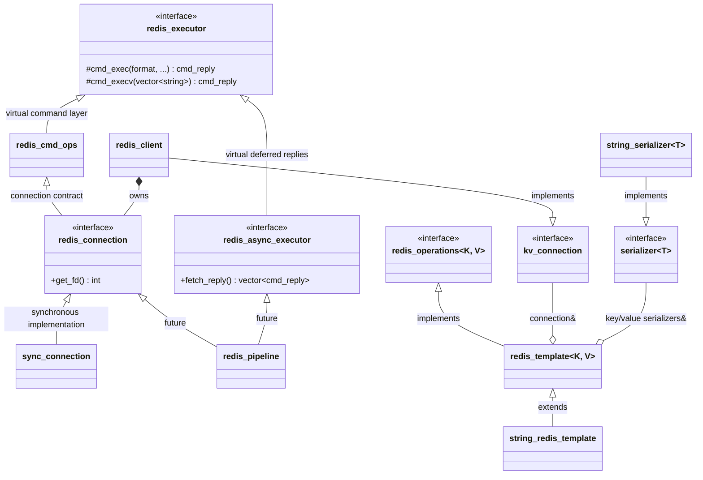
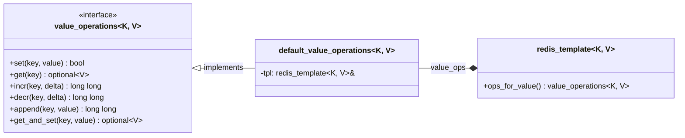
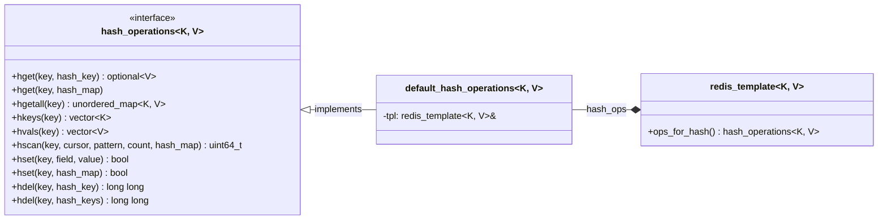
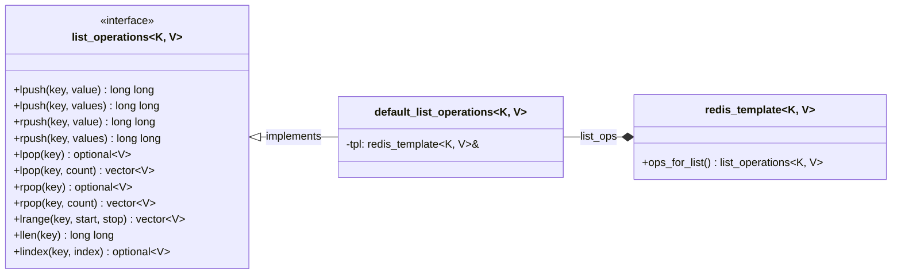
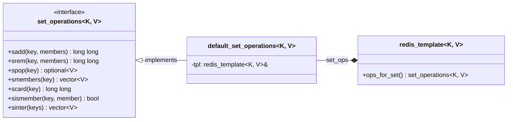
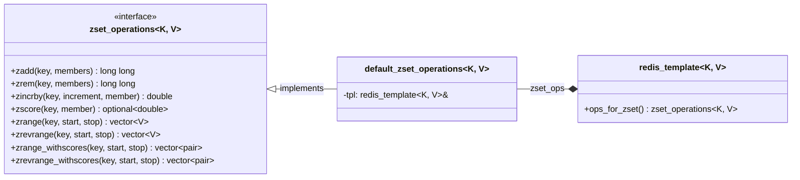
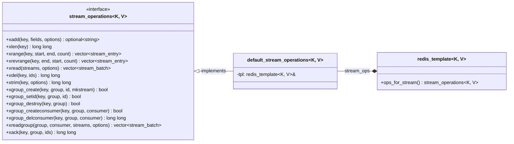
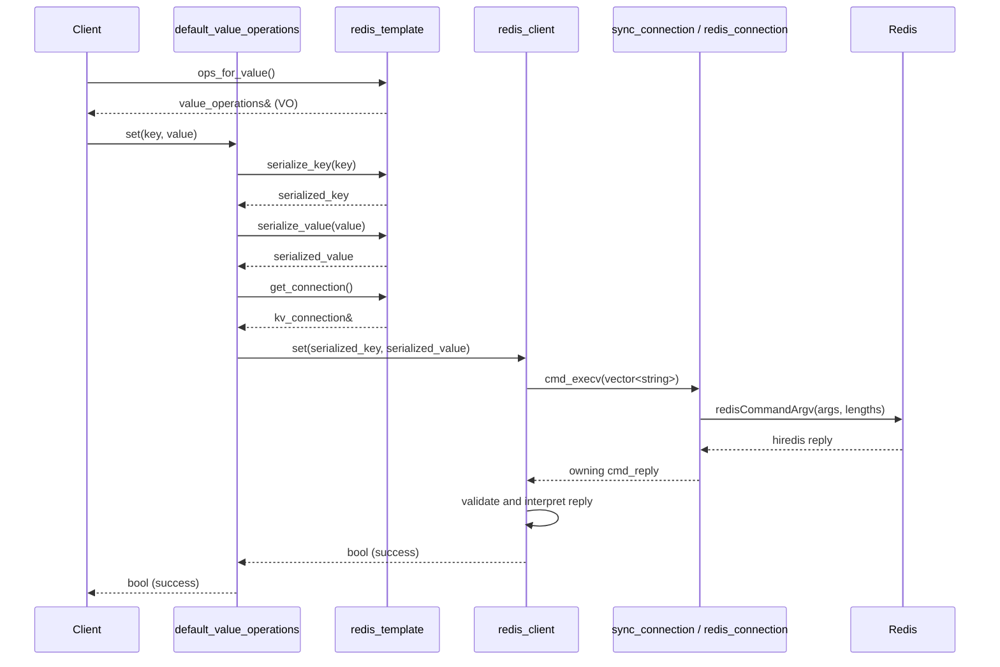

# RedisDAL Project Design Document

<!-- TOC -->
- [1. Project Overview](#1-project-overview)
- [2. Architecture Design](#2-architecture-design)
  - [2.1. Class Diagrams](#21-class-diagrams)
    - [2.1.1. Core Architecture](#211-core-architecture)
    - [2.1.2. Operation Views](#212-operation-views)
  - [2.2. Design Patterns](#22-design-patterns)
  - [2.3. Execution Contract](#23-execution-contract)
- [3. Usage Patterns](#3-usage-patterns)
  - [3.1. Basic Usage](#31-basic-usage)
  - [3.2. Operation Delegation Flow](#32-operation-delegation-flow)
- [4. Build System](#4-build-system)
  - [4.1. CMake vs Meson](#41-cmake-vs-meson)
  - [4.2. Build Commands](#42-build-commands)
- [5. Thread Safety](#5-thread-safety)
<!-- /TOC -->

## 1. Project Overview

RedisDAL is a C++ Redis client library based on hiredis, providing type-safe Redis operation interfaces.

## 2. Architecture Design

### 2.1. Class Diagrams

The diagrams are intentionally split by responsibility. Public command signatures are documented in the corresponding
headers instead of being duplicated here, which keeps these diagrams readable as command coverage grows.

#### 2.1.1. Core Architecture


```mermaid
classDiagram
    direction TB

    class serializer~T~ {
        <<interface>>
    }

    class string_serializer~T~

    class kv_connection {
        <<interface>>
    }

    class redis_cmd_ops
    class redis_client
    class redis_connection {
        <<interface>>
        +get_fd() int
    }
    class sync_connection
    class redis_executor {
        <<interface>>
        #cmd_exec(format, ...) cmd_reply
        #cmd_execv(vector~string~) cmd_reply
    }
    class redis_async_executor {
        <<interface>>
        +fetch_reply() vector~cmd_reply~
    }
    class redis_pipeline

    class redis_operations~K, V~ {
        <<interface>>
    }

    class redis_template~K, V~
    class string_redis_template

    string_serializer~T~ --|> serializer~T~: implements
    redis_client --|> kv_connection : implements
    redis_executor <|-- redis_cmd_ops : virtual command layer
    redis_cmd_ops <|-- redis_connection : connection contract
    redis_connection <|-- sync_connection : synchronous implementation
    redis_executor <|-- redis_async_executor : virtual deferred replies
    redis_connection <|-- redis_pipeline : future
    redis_async_executor <|-- redis_pipeline : future
    redis_client *-- redis_connection : owns
    redis_operations~K, V~ <|-- redis_template~K, V~ : implements
    redis_template~K, V~ <|-- string_redis_template : extends

    kv_connection --o redis_template~K, V~ : connection&
    serializer~T~ --o redis_template~K, V~ : key/value serializers&
```

- `redis_template<K, V>` implements the typed facade and owns the operation views; see
  [`redis_template.hpp`](../include/redisdal/redis_template.hpp).
- `serializer<T>` converts typed keys and values to Redis strings; `string_serializer<T>` is its default implementation.
- `kv_connection` remains the string-based client boundary; `redis_client` implements it and interprets replies.
- `redis_cmd_ops` virtually inherits `redis_executor`. It contains argv construction for every currently supported
  command family, including Stream, and returns raw `cmd_reply` values after invoking the protected
  `cmd_exec()`/`cmd_execv()` transport hooks. The same command layer is inherited by synchronous and future Pipeline
  connections.
- `redis_connection` inherits `redis_cmd_ops` and adds `get_fd()`. It is the common connection base for the synchronous
  implementation and a future Pipeline, without defining reconnection or connection-wait behavior.
- `sync_connection` inherits `redis_connection`, owns the hiredis context, initializes AUTH/SELECT, preserves the
  `exec()`/`execv()`/`exec_args()` transport family, and converts hiredis replies into owning `cmd_reply` values.
- `redis_async_executor` also virtually inherits `redis_executor` and adds reply retrieval. A future `redis_pipeline`
  inherits both `redis_connection` and `redis_async_executor`, but contains only one `redis_executor` base.
- `redis_client(url)` owns a `sync_connection`; its injection constructor accepts another `redis_connection` for tests.
  URL parsing lives in `redis_config.cpp`.
- `string_redis_template` is the convenience specialization that owns its string serializer.

#### 2.1.2. Operation Views

`redis_template<K, V>` exposes one accessor for each Redis data type. Every accessor returns an operation interface whose
default implementation serializes typed data and delegates to the shared connection boundary.

##### 2.1.2.1. String / Value


```mermaid
classDiagram
    direction LR

    class redis_template~K, V~ {
        +ops_for_value() value_operations~K, V~
    }
    class value_operations~K, V~ {
        <<interface>>
        +set(key, value) bool
        +get(key) optional~V~
        +incr(key, delta) long long
        +decr(key, delta) long long
        +append(key, value) long long
        +get_and_set(key, value) optional~V~
    }
    class default_value_operations~K, V~ {
        -tpl: redis_template~K, V~&
    }

    value_operations~K, V~ <|-- default_value_operations~K, V~ : implements
    default_value_operations~K, V~ --* redis_template~K, V~ : value_ops
```

##### 2.1.2.2. Hash


```mermaid
classDiagram
    direction LR

    class redis_template~K, V~ {
        +ops_for_hash() hash_operations~K, V~
    }
    class hash_operations~K, V~ {
        <<interface>>
        +hget(key, hash_key) optional~V~
        +hget(key, hash_map)
        +hgetall(key) unordered_map~K, V~
        +hkeys(key) vector~K~
        +hvals(key) vector~V~
        +hscan(key, cursor, pattern, count, hash_map) uint64_t
        +hset(key, field, value) bool
        +hset(key, hash_map) bool
        +hdel(key, hash_key) long long
        +hdel(key, hash_keys) long long
    }
    class default_hash_operations~K, V~ {
        -tpl: redis_template~K, V~&
    }

    hash_operations~K, V~ <|-- default_hash_operations~K, V~ : implements
    default_hash_operations~K, V~ --* redis_template~K, V~ : hash_ops
```

##### 2.1.2.3. List


```mermaid
classDiagram
    direction LR

    class redis_template~K, V~ {
        +ops_for_list() list_operations~K, V~
    }
    class list_operations~K, V~ {
        <<interface>>
        +lpush(key, value) long long
        +lpush(key, values) long long
        +rpush(key, value) long long
        +rpush(key, values) long long
        +lpop(key) optional~V~
        +lpop(key, count) vector~V~
        +rpop(key) optional~V~
        +rpop(key, count) vector~V~
        +lrange(key, start, stop) vector~V~
        +llen(key) long long
        +lindex(key, index) optional~V~
    }
    class default_list_operations~K, V~ {
        -tpl: redis_template~K, V~&
    }

    list_operations~K, V~ <|-- default_list_operations~K, V~ : implements
    default_list_operations~K, V~ --* redis_template~K, V~ : list_ops
```

##### 2.1.2.4. Set


```mermaid
classDiagram
    direction LR

    class redis_template~K, V~ {
        +ops_for_set() set_operations~K, V~
    }
    class set_operations~K, V~ {
        <<interface>>
        +sadd(key, members) long long
        +srem(key, members) long long
        +spop(key) optional~V~
        +smembers(key) vector~V~
        +scard(key) long long
        +sismember(key, member) bool
        +sinter(keys) vector~V~
    }
    class default_set_operations~K, V~ {
        -tpl: redis_template~K, V~&
    }

    set_operations~K, V~ <|-- default_set_operations~K, V~ : implements
    default_set_operations~K, V~ --* redis_template~K, V~ : set_ops
```

##### 2.1.2.5. Sorted Set


```mermaid
classDiagram
    direction LR

    class redis_template~K, V~ {
        +ops_for_zset() zset_operations~K, V~
    }
    class zset_operations~K, V~ {
        <<interface>>
        +zadd(key, members) long long
        +zrem(key, members) long long
        +zincrby(key, increment, member) double
        +zscore(key, member) optional~double~
        +zrange(key, start, stop) vector~V~
        +zrevrange(key, start, stop) vector~V~
        +zrange_withscores(key, start, stop) vector~pair~
        +zrevrange_withscores(key, start, stop) vector~pair~
    }
    class default_zset_operations~K, V~ {
        -tpl: redis_template~K, V~&
    }

    zset_operations~K, V~ <|-- default_zset_operations~K, V~ : implements
    default_zset_operations~K, V~ --* redis_template~K, V~ : zset_ops
```

##### 2.1.2.6. Stream


```mermaid
classDiagram
    direction LR

    class redis_template~K, V~ {
        +ops_for_stream() stream_operations~K, V~
    }
    class stream_operations~K, V~ {
        <<interface>>
        +xadd(key, fields, options) optional~string~
        +xlen(key) long long
        +xrange(key, start, end, count) vector~stream_entry~
        +xrevrange(key, end, start, count) vector~stream_entry~
        +xread(streams, options) vector~stream_batch~
        +xdel(key, ids) long long
        +xtrim(key, options) long long
        +xgroup_create(key, group, id, mkstream) bool
        +xgroup_setid(key, group, id) bool
        +xgroup_destroy(key, group) bool
        +xgroup_createconsumer(key, group, consumer) bool
        +xgroup_delconsumer(key, group, consumer) long long
        +xreadgroup(group, consumer, streams, options) vector~stream_batch~
        +xack(key, group, ids) long long
    }
    class default_stream_operations~K, V~ {
        -tpl: redis_template~K, V~&
    }

    stream_operations~K, V~ <|-- default_stream_operations~K, V~ : implements
    default_stream_operations~K, V~ --* redis_template~K, V~ : stream_ops
```

The complete operation signatures live in [`operations.hpp`](../include/redisdal/operations.hpp). Each
`default_*_operations` implementation performs serialization and delegates to the shared `kv_connection` boundary.

### 2.2. Design Patterns

RedisDAL uses the following patterns and design techniques. The names describe concrete responsibilities in the
implementation rather than every inheritance or composition relationship in the class diagrams.

| Pattern / technique | Participants | Purpose |
|---|---|---|
| Facade | `redis_operations<K, V>`, `redis_template<K, V>` | Presents one typed entry point for key-level commands and the String, Hash, List, Set, Sorted Set, and Stream operation views. |
| Strategy | `serializer<T>`, `string_serializer<T>` | Makes serialization policy replaceable independently from command execution. |
| Template Method | `redis_cmd_ops`, `redis_executor`, concrete connections | Command methods assemble argv and delegate the execution step to a concrete connection. |
| Adapter | `sync_connection`, hiredis | Converts the hiredis C connection and reply tree to the library execution contract. |
| Constructor Injection | `redis_template<K, V>` and its connection/serializer references | Decouples the facade from concrete connection and serialization implementations and makes substitutes usable in tests. The injected objects must outlive the facade. |
| Composition and Delegation | `redis_template<K, V>`, `default_*_operations` | The facade owns one implementation per operation view. Each view serializes typed arguments and delegates the actual command to `kv_connection`. |

The execution split applies the six design principles at the new boundary: single responsibility separates connection
lifetime from command behavior; open/closed and dependency inversion allow a new execution strategy to implement
`redis_executor`; Liskov substitution requires every executor to preserve the same reply and failure contract;
interface segregation keeps formatted and vector execution in the small execution interface; and least knowledge keeps the
typed facade unaware of hiredis resources. `kv_connection` stays intact for source compatibility.
The GoF patterns above are used where they describe the implementation; the split does not require applying all 23 patterns.

The operation views do not implement the Template Method pattern: no base class defines an algorithm skeleton whose
steps are overridden by subclasses. Their interaction is composition and delegation, as shown in Section 3.2.

### 2.3. Execution Contract

The argument vector owns every argument, including the command name. Embedded NUL bytes, spaces and empty arguments
retain their lengths. `cmd_execv()` borrows the vector for the duration of the call and returns an owning reply tree.
For `sync_connection`, the returned value is the server reply. An implementation that also inherits
`redis_async_executor` may queue the command and later return ordered replies from `fetch_reply()`.

Following the reference hierarchy, a future Pipeline inherits `redis_connection` for command construction and fd
access, plus `redis_async_executor` for retrieving deferred replies. Virtual inheritance on the two branches avoids the
reference implementation's duplicate `redis_executor` base and makes conversion to the execution interface unambiguous.

Executors preserve server ERROR and NIL replies as values, and throw on transport or protocol failures. They must not
retry implicitly: a lost response can follow an already executed write. `redis_client` converts top-level ERROR replies to `redis_error`
and EVALSHA NOSCRIPT to `no_script_error`; errors nested in raw or Lua arrays remain values. The existing typed facade
continues to own script-cache reload behavior. `get_signed_integer()` exposes signed Redis integers; the existing
`get_integer()` retains its unsigned representation for compatibility.

Command-specific parsing validates structured reply shapes, including paired hash/score fields, scan cursors and stream
entries.
Malformed replies now fail explicitly instead of being silently skipped by some of the former decoders. Valid Redis
replies retain existing semantics, including negative TTLs, NIL, duplicate stream fields and deleted pending entries.
RESP2 remains the hiredis backend's supported protocol; this refactor does not add RESP3, pipelining or reconnection.

`sync_connection` directly owns its hiredis context. Connection resources are released on destruction and constructor
failure. `redis_client` owns the selected connection; copies are disabled and ownership can be moved.
`redis_config::db` and `query_info::db` are renamed to `index`. Downstream code must rebuild and link the new library
because the former inline connection implementation moved into separate compiled units.
The duration parameters of `expire()`, `pexpire()`, `set_ex()`, and `set_px()` use `long long` throughout their public
and command layers, so no layer narrows a Redis duration before constructing the command.
The protected `exec()`, `execv()` and `exec_args()` helpers remain the hiredis transport family on `sync_connection`.
A test or alternative backend implements `redis_connection` and is injected into `redis_client`.

The `execution_test` target injects a scripted `redis_connection` into `redis_client` to check requests and decoding
without Redis. `redis_connection_test` and the other integration tests exercise the hiredis implementation through
public operations, including authentication/database selection,
connection moves and replies that outlive the connection.

---

## 3. Usage Patterns

### 3.1. Basic Usage

```cpp
#include <redisdal/redisdal.hpp>

int main() {
    // Connection is established in the constructor
    redisdal::redis_client conn("redis://127.0.0.1:6379");

    // string_redis_template is a convenience alias for redis_template<string, string>
    // that manages its own string_serializer instances internally
    redisdal::string_redis_template rt(conn);

    // String operations
    rt.ops_for_value().set("key", "value");
    auto val = rt.ops_for_value().get("key");

    // Hash operations
    rt.ops_for_hash().hset("user:1", "name", "Alice");

    // Stream operations
    auto id = rt.ops_for_stream().xadd("events", {{"type", "user.created"}});
    auto events = rt.ops_for_stream().xrange("events", "-", "+");

    // Key-level operations are on redis_template directly
    rt.expire("key", 60);
    bool found = rt.exists("key");

    return 0;
}
```

### 3.2. Operation Delegation Flow

The following sequence shows how a typed operation passes through an owned operation view to the string-based
connection boundary.


```mermaid
sequenceDiagram
    participant Client
    participant VO as default_value_operations
    participant RT as redis_template
    participant Conn as redis_client
    participant Exec as sync_connection / redis_connection
    participant Redis

    Client->>RT: ops_for_value()
    RT-->>Client: value_operations& (VO)
    Client->>VO: set(key, value)
    VO->>RT: serialize_key(key)
    RT-->>VO: serialized_key
    VO->>RT: serialize_value(value)
    RT-->>VO: serialized_value
    VO->>RT: get_connection()
    RT-->>VO: kv_connection&
    VO->>Conn: set(serialized_key, serialized_value)
    Conn->>Exec: cmd_execv(vector<string>)
    Exec->>Redis: redisCommandArgv(args, lengths)
    Redis-->>Exec: hiredis reply
    Exec-->>Conn: owning cmd_reply
    Conn->>Conn: validate and interpret reply
    Conn-->>VO: bool (success)
    VO-->>Client: bool (success)
```

---

## 4. Build System

### 4.1. CMake vs Meson

| Feature | CMake | Meson |
|---------|-------|-------|
| Minimum Version | 3.10 | - |
| Library Type | SHARED | library() |
| Dependency Finding | find_package | dependency() |
| Test Framework | FetchContent + GTest | subproject + system |
| Install Path | lib/ | lib/ |

### 4.2. Build Commands

```bash
# CMake
mkdir build && cd build
cmake .. -DENABLE_REDISDAL_TEST=ON
make

# Meson
meson setup build -Denable_redisdal_test=true
meson compile -C build
meson test -C build
```

---

## 5. Thread Safety

`redis_template`, `redis_cmd_ops` and `sync_connection` instances require external synchronization
when shared. Each thread can instead own an independent connection and facade. A shared hiredis context still requires
external synchronization.
